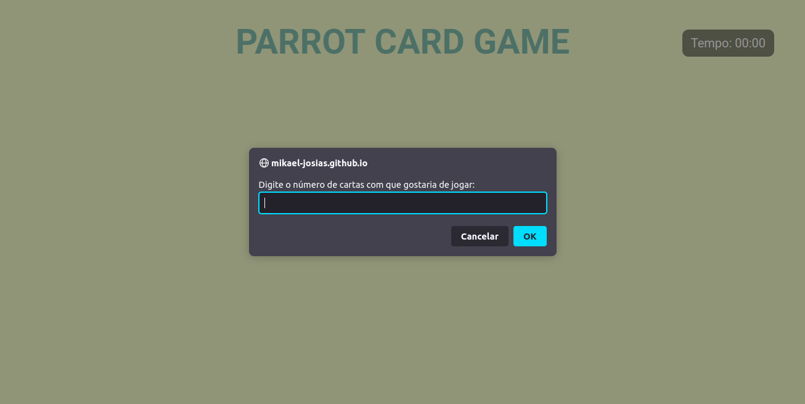
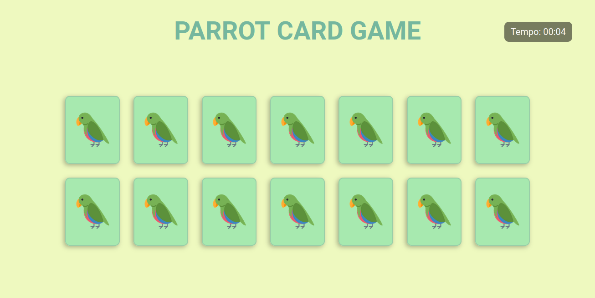
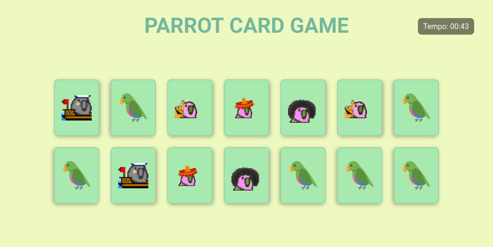
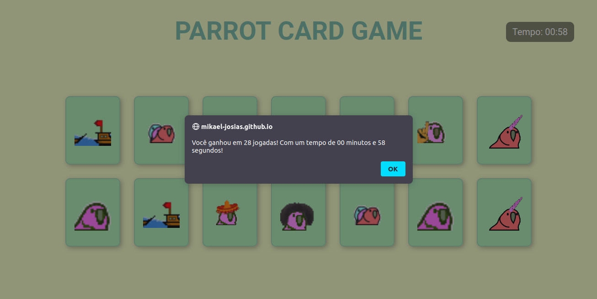

# Parrot's Card Game
## Projeto 04

---
## ✒️ Descrição:
Quarto projeto do Pimeiro Módulo do curso de Desenvolvimento Full Stack da Driven Education.

Parrot's Card Game é um jogo da memória divertido e temático, com efeitos de transição, responsividade e papagaios coloridos!

---
## 🎯 Requisitos:

✅ Fazer o versionamento do código usando o GitHub.  
✅ Recriar o layout fornecido no figma.  
✅ Embaralhar as cartas de forma aleatória.  
✅ Adicionar animações de movimento ao virar as cartas.  
✅ Exibir o número de jogadas e o tempo de jogo ao final.  

---

  <h2>Tecnologias utilizadas:</h2>
  
  
   

---

  

## 📱 Prévia Desktop 📱  

